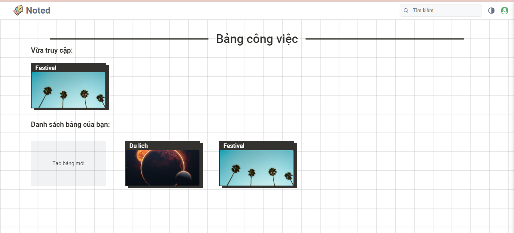
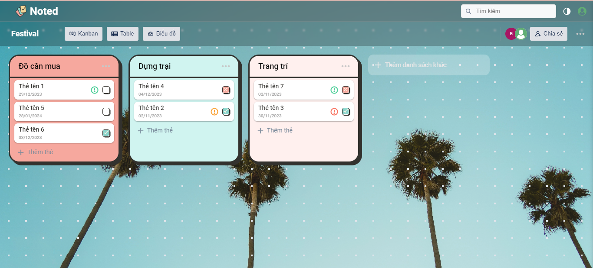
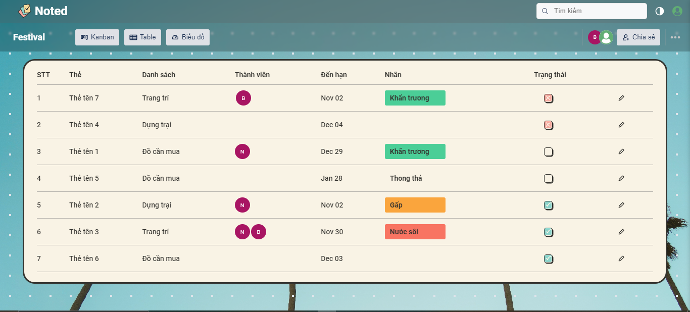
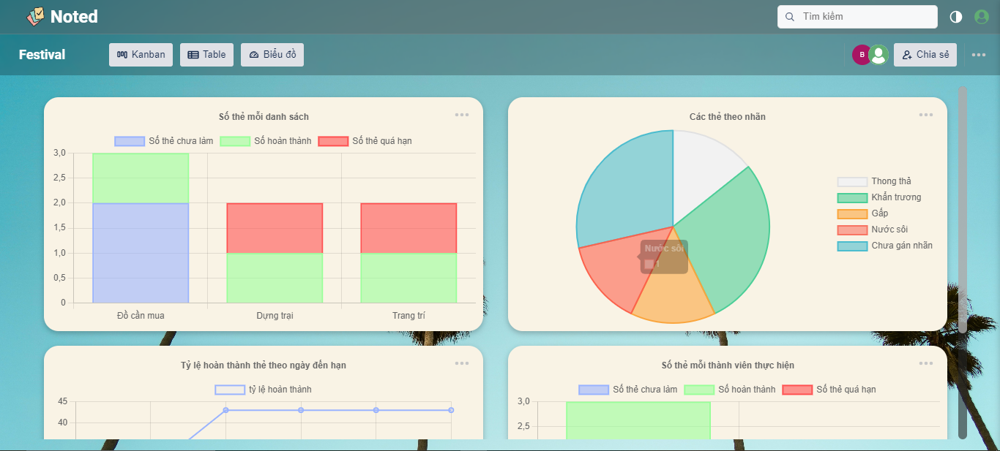

# Overview
This is a website that supports job management with frontend using Reactjs, backend using express of nodejs and database using MySQL

# Installation
   1. Be sure that you  installed Node.js (version compatible with React 18) on your system
   
   2. Install the project dependencies
      ```base
      npm install --force
      ```
   3. Setup database with MySQL
      
      - Open the MySQL software and execute the commands in the `schema.sql` file.
      - Modify the following properties in the `.env` file according to your database setup:
  
         ```base
         HTTPS=true
         MYSQL_HOST='127.0.0.1'
         MYSQL_USER='root'
         MYSQL_PASSWORD='12345'
         MYSQL_DATABASE='noted'
         ```

# Running the Application
   1. Start Backend Server:

   ```base
   node app.js
   ```

   2. In a new terminal window, start the Frontend:

   ```base
   npm start
   ```
   3. You can test the application with account below:

      email: nguyenvana@gmail.com
      
      password: 12345 

# Demo 

   
   
   
   